# 💀 ap1ph3x

**The payment protocol that never dies.**

Open-source x402 + MPP client for AI agents. Multi-chain. Zero custody. 31+ public API registry included.

```
npm install ap1ph3x
```



---

## Why ap1ph3x?

| Normal Payment SDKs | ap1ph3x |
|---|---|
| Proprietary lock-in | MIT, open-source forever |
| Single chain | 6 chains (Base, ETH, Tempo, Polygon, Monad, BSC) |
| Custodial risk | Zero custody — key never leaves your process |
| Single protocol | x402 **AND** MPP auto-detection |
| Manual API discovery | 31+ API registry built-in |
| No free API support | 17 free APIs (no key, no payment needed) |

## Quick Start

```typescript
import { Ap1ph3x } from 'ap1ph3x';

const pay = new Ap1ph3x({
  privateKey: process.env.PRIVATE_KEY as `0x${string}`,
  chain: 'base',
  maxPerCall: 0.01,  // USDC
  maxPerDay: 10.00,  // USDC
});

// fetch a paid API endpoint — ap1ph3x handles the 402 flow automatically
const data = await pay.fetch('https://api.exa.ai/search', {
  method: 'POST',
  body: { query: 'machine payments' },
});

console.log(data);  // ✅ response body + payment receipt
```

## CLI

```bash
npx ap1ph3x fetch https://api.exa.ai/search --method POST --body '{"query":"test"}'
npx ap1ph3x wallet   # show wallet info
npx ap1ph3x test     # self-test
```

## API Registry

ap1ph3x ships with a curated registry of 31+ public APIs:

```typescript
import { getFreeAPIs, getX402APIs, getSelfHostableAPIs } from 'ap1ph3x';

getFreeAPIs();         // 17 free APIs (no key, no payment)
getX402APIs();         // 2 x402-compatible paid APIs
getSelfHostableAPIs(); // 10 self-hostable (privacy-first)
```

### Categories

| Category | Count | Examples |
|---|---|---|
| Search | 5 | Exa, DuckDuckGo, Wikipedia, OpenAlex, SearXNG |
| Crypto | 8 | CoinGecko, DefiLlama, Etherscan, CMC, RPC endpoints |
| AI | 4 | HuggingFace, Ollama, OpenRouter, LocalAI |
| Social | 5 | Nansen, Hacker News, Reddit, Mastodon, RSS-Bridge |
| Developer | 6 | GitHub, GitLab, npm, PyPI, DNS, httpbin |
| Weather/Location | 3 | Open-Meteo, Nominatim, OSRM |

## Architecture

```
┌─────────────────────────────────────────┐
│            ap1ph3x                     │
│  ┌─────────────────────────────────┐    │
│  │         Ap1ph3x (main)         │    │
│  │   ┌──────────┐ ┌──────────────┐  │    │
│  │   │ X402     │ │  MPP         │  │    │
│  │   │ Client   │ │  Client      │  │    │
│  │   └────┬─────┘ └──────┬───────┘  │    │
│  │        └──────┬───────┘          │    │
│  │          ┌────▼─────┐            │    │
│  │          │  Wallet  │            │    │
│  │          │ (viem)   │            │    │
│  │          └──────────┘            │    │
│  └─────────────────────────────────┘    │
│  ┌─────────────────────────────────┐    │
│  │       API Registry (31+)        │    │
│  │  search|crypto|ai|social|dev|... │    │
│  └─────────────────────────────────┘    │
└─────────────────────────────────────────┘
```

## Supported Chains

| Chain | Chain ID | USDC | Native |
|---|---|---|---|
| Base | 8453 | ✅ | ETH |
| Ethereum | 1 | ✅ | ETH |
| Tempo | 5042 | ✅ | ETH |
| Polygon | 137 | ✅ | MATIC |
| Monad (testnet) | 10143 | ❌ | MON |
| BSC | 56 | ✅ | BNB |

## License

MIT — Dropxtor (@0xDropxtor)

## Links

- **GitHub**: [github.com/dropmoltbot/ap1ph3x](https://github.com/dropmoltbot/ap1ph3x)
- **npm**: `npm install ap1ph3x`

```
  ┌─┐ ┌─┐
  │N3│ │CR│
  │ 0│ │ P│
  │- │ │ A│
  │  │ │ Y│
  └─┘ └─┘
  The payment protocol that never dies.
```

💀 Built by [Dropxtor](https://github.com/dropmoltbot) · MIT License · 2026